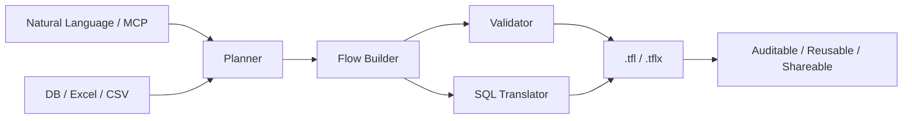
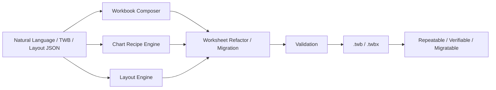

  

    

      

        Datacooper · Tableau User Group Sharing
      

      <h1 class="mt-4 max-w-5xl text-5xl font-black tracking-[-0.05em] leading-[0.94] text-primary md:text-6xl">
        From Manual Dragging to Engineering BI
      </h1>
      

        <strong class="text-foreground">cwprep</strong> automates Tableau Prep flows, 
        <strong class="text-foreground">cwtwb</strong> handles engineering generation of Tableau Workbooks, 
        <strong class="text-foreground">datacooper.com</strong> builds these into user-friendly online tools.
      

      

        cwtwb/cwprep = BI Development Accelerator
        MCP
        Repeatable
        Auditable
        Migratable
      

    

  

---
layout: fact
---

# Positioning of cwtwb/cwprep

## Accelerating the BI Development Process

  Not replacing BI developers, but handing over repetitive, mechanical, and rule-based tasks to tools.

---
layout: center
class: text-center
---

# Tableau's Position in the Data Analytics Lifecycle

  

    
1. Data Ingestion

    
DB, Excel, CSV, API

  

  

    
2. Data Prep

    
Clean, Transform, Join, Agg

  

  

    
3. Tableau

    
Modeling, Calc, Layout, Viz

  

  

    
4. Distribution

    
Publish, Review, Iterate

  

  

    
5. Optimization

    
Revise Data, Adjust Design

  

  cwprep focuses on "Data Prep", cwtwb focuses on "Tableau Generation & Orchestration", with Tableau serving as the analytic expression.

---
layout: section
---

# Why Build These Tools?

---
layout: center
class: text-center
---

# The Pain of Manual Labor

  

    The most time-consuming part in Tableau isn't "drawing a chart," but doing these mechanical tasks repeatedly.
  

  

    
Repeatedly dragging fields

    
Repeatedly adjusting layouts

    
Repeatedly copying KPI modules

    
Repeatedly migrating workbooks

    
Repeatedly checking if files open correctly

    
Repeatedly fixing small issues

  

  

    None of these are difficult alone, but they add no new business value while consuming development time.
  

---
layout: center
---

# Paradigm Shift & Quick Generation Demo

  <!-- Left: Paradigm Comparison -->
  

    

      <h3 class="text-xl font-bold mb-3 text-foreground">Manual (Traditional)</h3>
      <ul class="space-y-2 text-muted-foreground text-sm">
        <li>❌ 300+ repetitive mouse clicks</li>
        <li>❌ Non-reusable binary .twb files</li>
        <li>❌ Full re-dragging for changes</li>
        <li>❌ Logic hidden in GUI, non-auditable</li>
      </ul>
    

    

      <h3 class="text-xl font-bold mb-3 text-primary">Engineering (Modern)</h3>
      <ul class="space-y-2 text-foreground font-medium text-sm">
        <li>✅ Single command/prompt generation</li>
        <li>✅ Plain-text config, Git-friendly</li>
        <li>✅ Modular components, rapid swapping</li>
        <li>✅ Code is documentation, fully traceable</li>
      </ul>
    

  

  <!-- Right: Video Demos -->
  

    

      

        <Youtube id="b7WrC0ngqwk" width="100%" height="100%" />
      

      <h4 class="font-bold text-xs">Zero Barrier Text-to-Flow</h4>
    

    

      

        <Youtube id="4RMevXQObkE" width="100%" height="100%" />
      

      <h4 class="font-bold text-xs">Agent Complex Logic Parsing</h4>
    

  

---
layout: center
class: text-center
---

# Who Is This For?

  

    <h3 class="mt-2 text-lg font-bold text-foreground">Tableau Analysts</h3>
    
Less repetitive dragging and copying — more time for insights and business judgment.

  

  

    <h3 class="mt-2 text-lg font-bold text-foreground">Data Engineering / IT</h3>
    
Automation, version control, and batch deployment — bringing BI into engineering workflows.

  

  

    <h3 class="mt-2 text-lg font-bold text-foreground">Team Leads / Managers</h3>
    
Auditable, repeatable deliverables — reducing key-person dependency and knowledge loss.

  

---
layout: section
---

# cwprep

---
layout: center
class: text-center
---

# cwprep Architecture

---
layout: center
class: text-center
---

# cwprep vs Tableau Agent

  

    <h3 class="text-lg font-bold text-foreground">Tableau Agent</h3>
    <ul class="mt-3 space-y-2 text-sm leading-6 text-muted-foreground">
      <li>Closed-source, official product</li>
      <li>Natural language driven Prep flows</li>
      <li>Tableau Cloud only</li>
      <li>No Join / Union support</li>
      <li>No SQL export</li>
    </ul>
  

  

    
VS

  

  

    <h3 class="text-lg font-bold text-primary">cwprep</h3>
    <ul class="mt-3 space-y-2 text-sm leading-6 text-foreground font-medium">
      <li>Open-source, self-hosted</li>
      <li>Natural language + code dual mode</li>
      <li>Any environment</li>
      <li class="text-primary font-bold">✅ Join / Union / Pivot</li>
      <li class="text-primary font-bold">✅ Flow → SQL Translation</li>
    </ul>
  

---
layout: center
---

# cwprep Typical Cases & Quick Demo

  

    

      <h3 class="text-xl font-bold mb-3 text-primary">Case 1: Zero Barrier Generation</h3>
      

        No local environment needed. Users send cleaning logic in natural language to the Agent, and the system generates a standard .tfl file in seconds.
      

      <ul class="mt-3 space-y-1 text-xs text-foreground font-medium">
        <li>✅ Text-to-Flow in seconds</li>
        <li>✅ Web-based, lightweight, no install</li>
      </ul>
    

    

      <h3 class="text-xl font-bold mb-3 text-primary">Case 2: Complex Logic Parsing</h3>
      

        Agent deeply understands multi-step, cross-table business descriptions (Orders, Returns, Customers) and translates them into data pipelines.
      

      <ul class="mt-3 space-y-1 text-xs text-foreground font-medium">
        <li>✅ Auto-detect ER relations & Joins</li>
        <li>✅ Handle complex aggregations & filters</li>
      </ul>
    

  

  

    

      

        <Youtube id="b7WrC0ngqwk" width="100%" height="100%" />
      

      <h4 class="font-bold text-xs text-center">Demo: Seconds Response (Text-to-Flow)</h4>
    

    

      

        <Youtube id="4RMevXQObkE" width="100%" height="100%" />
      

      <h4 class="font-bold text-xs text-center">Demo: Deep Parsing (Multi-table Logic)</h4>
    

  

---
layout: section
---

# cwtwb

---
layout: center
class: text-center
---

# cwtwb Architecture

---
layout: center
class: text-center
---

# cwtwb vs Tableau Agent (Web)

  

    <h3 class="text-lg font-bold text-foreground">Tableau Agent (Web)</h3>
    <ul class="mt-3 space-y-2 text-sm leading-6 text-muted-foreground">
      <li>Limited to Worksheets only</li>
      <li>Cannot build Dashboards</li>
      <li>No advanced formatting support</li>
      <li>No support for Params/Sets</li>
    </ul>
  

  

    
VS

  

  

    <h3 class="text-lg font-bold text-primary">cwtwb</h3>
    <ul class="mt-3 space-y-2 text-sm leading-6 text-foreground font-medium">
      <li class="text-primary font-bold">✅ Full Dashboard Orchestration</li>
      <li class="text-primary font-bold">✅ Declarative Layout & Formatting</li>
      <li class="text-primary font-bold">✅ XSD Validation & Versioning</li>
    </ul>
  

---
layout: default
---

# cwtwb: One Sentence Intro

  

    <h2 class="mt-3 text-3xl font-black tracking-[-0.04em] text-foreground md:text-4xl">
      Turning Tableau workbooks into repeatable, verifiable, and migratable assets.
    </h2>
    

      

        
Deterministic Output

        
Stable results, no manual error.

      

      

        
Verifiable Delivery

        
XSD validation ensures files open.

      

    

  

  

    

      Core Value
    

    cwprep manages data flows, cwtwb manages dashboard generation. 
    Integrating BI into scripts, version control, and batch production.
  

---
layout: center
---

# cwtwb Cases & Closed-loop Demo

  

    

      <h3 class="text-xl font-bold mb-3 text-primary">Case 3: Declarative Code & Auto Fix</h3>
      

        Python framework demo: Schema awareness, code generation, script execution, and automatic bug fixing.
      

      <ul class="mt-3 space-y-1 text-xs text-foreground font-medium">
        <li>✅ AI perceives DB Schema / ER diagrams</li>
        <li>✅ <strong>Highlight:</strong> Agent auto-fixes case-sensitive filter bugs</li>
      </ul>
    

    

      <h3 class="text-xl font-bold mb-3 text-primary">Case 4: End-to-End Live Rendering</h3>
      

        From raw docs to functional Tableau dashboards. Watch the rendering process live in the Tableau client.
      

      <ul class="mt-3 space-y-1 text-xs text-foreground font-medium">
        <li>✅ Full end-to-end automation loop</li>
        <li>✅ "Hot-reload" experience for BI dashboards</li>
      </ul>
    

  

  

    

      

        <Youtube id="dNzMbLOEA7A" width="100%" height="100%" />
      

      <h4 class="font-bold text-xs text-center">Demo: Python Practice & Auto Bug Fix</h4>
    

    

      

        <Youtube id="NMy4__CCCDI" width="100%" height="100%" />
      

      <h4 class="font-bold text-xs text-center">Demo: Dashboard Live Rendering</h4>
    

  

---
layout: section
---

# datacooper.com

---
layout: default
---

# datacooper Online Tool Prototypes

  

    

      <h2 class="mt-3 text-3xl font-black tracking-[-0.04em] text-foreground md:text-4xl">
        Building a platform, not just scripts.
      </h2>
    

    

      
Online Access

      
Code-to-Tool

    

  

  

    

      

        
Layout Parsing

        
Extract dashboard structures, export to JSON.

      

      

        
KPI Cloning

        
Clone KPI sheets, swap metrics only, preserve styles.

      

    

  

---
layout: center
class: text-center
---

# Try It Out

  

    

      
$ pip install cwprep cwtwb

      
$ cwprep-mcp # start cwprep MCP server

      
$ cwtwb-mcp # start cwtwb MCP server

    

  

  

    

      
GitHub

      
github.com/imgwho/cwprep / cwtwb

    

    

      
datacooper.com

      
Online Tools · Docs · Community

    

  

---
layout: section
---

# Q&A / Discussion

---
layout: quote
---

# Don't leave Tableau. Let AI give time back to humans.
