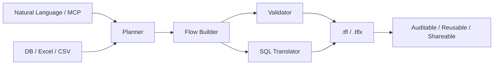
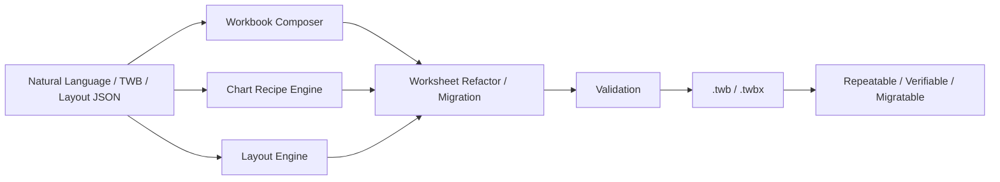

  

    

      

        Datacooper · Tableau User Group Sharing
      

      <h1 class="mt-4 max-w-5xl text-5xl font-black tracking-[-0.05em] leading-[0.94] text-primary md:text-6xl">
        From Manual Dragging to Engineering BI
      </h1>
      

        <strong class="text-foreground">cwprep</strong> automates Tableau Prep flows, 
        <strong class="text-foreground">cwtwb</strong> handles engineering generation of Tableau Workbooks, 
        <strong class="text-foreground">datacooper.com</strong> builds these into user-friendly online tools.
      

      

        cwtwb/cwprep = BI Development Accelerator
        MCP
        Repeatable
        Auditable
        Migratable
      

    

  

---
layout: fact
---

# Positioning of cwtwb/cwprep

## Accelerating the BI Development Process

  Not replacing BI developers, but handing over repetitive, mechanical, and rule-based tasks to tools.

---
layout: center
class: text-center
---

# Tableau's Position in the Data Analytics Lifecycle

  

    
1. Data Ingestion

    
DB, Excel, CSV, API

  

  

    
2. Data Prep

    
Clean, Transform, Join, Agg

  

  

    
3. Tableau

    
Modeling, Calc, Layout, Viz

  

  

    
4. Distribution

    
Publish, Review, Iterate

  

  

    
5. Optimization

    
Revise Data, Adjust Design

  

  cwprep focuses on "Data Prep", cwtwb focuses on "Tableau Generation & Orchestration", with Tableau serving as the analytic expression.

---
layout: section
---

# Why Build These Tools?

---
layout: center
class: text-center
---

  

    The most time-consuming part in Tableau isn't "drawing a chart," but doing these mechanical tasks repeatedly.
  

  

    
Repeatedly dragging fields

    
Repeatedly adjusting layouts

    
Repeatedly copying KPI modules

    
Repeatedly migrating workbooks

    
Repeatedly checking if files open correctly

    
Repeatedly fixing small but time-consuming issues

  

  

    None of these are difficult alone, but they add no new business value while consuming development time.
  

---
layout: center
---

# Paradigm Shift in Development

  

    <h3 class="text-2xl font-bold mb-6 text-foreground">Manual Approach</h3>
    <ul class="space-y-4 text-muted-foreground text-lg">
      <li class="flex items-start gap-3">❌ 300+ repetitive mouse clicks</li>
      <li class="flex items-start gap-3">❌ Non-reusable binary .twb files</li>
      <li class="flex items-start gap-3">❌ Full re-dragging for changes</li>
      <li class="flex items-start gap-3">❌ Logic hidden deep in GUI, non-auditable</li>
    </ul>
  

  
  

    <h3 class="text-2xl font-bold mb-6 text-primary">Engineering Approach</h3>
    <ul class="space-y-4 text-foreground font-medium text-lg">
      <li class="flex items-start gap-3">✅ Single command/prompt generation</li>
      <li class="flex items-start gap-3">✅ Plain-text config, Git-friendly</li>
      <li class="flex items-start gap-3">✅ Modular components, rapid swapping</li>
      <li class="flex items-start gap-3">✅ Code is documentation, fully traceable</li>
    </ul>
  

---
layout: center
class: text-center
---

# Who Is This For?

  

    <!-- 
📊
 -->
    <h3 class="mt-2 text-lg font-bold text-foreground">Tableau Analysts</h3>
    
Less repetitive dragging and copying — more time for insights and business judgment.

  

  

    <!-- 
⚙️
 -->
    <h3 class="mt-2 text-lg font-bold text-foreground">Data Engineering / IT</h3>
    
Automation, version control, and batch deployment — bringing BI into engineering workflows.

  

  

    <!-- 
📋
 -->
    <h3 class="mt-2 text-lg font-bold text-foreground">Team Leads / Managers</h3>
    
Auditable, repeatable deliverables — reducing key-person dependency and knowledge loss.

  

---
layout: section
---

# cwprep

---
layout: center
class: text-center
---

# cwprep Architecture

---
layout: default
---

## cwprep

### One Prompt

Input one sentence, output a usable Tableau Prep `.tfl` / `.tflx` file.

### What it can do

- Text-to-PrepFlow: Describe data logic in natural language
- MCP Integration: Works with Claude, Gemini, Cursor
- Avoid GUI Dependency: Build flows without opening Tableau Prep
- Auditable: Translates flows to SQL for DBA/Compliance review

  MCP (Model Context Protocol) is an open protocol for AI tool interoperability — think of it as a <strong class="text-foreground">USB port for AI</strong>

  22 Flow Operations
  4 Databases
  SQL Translation
  TFLX Packaging

---
layout: center
class: text-center
---

# cwprep Typical Use Cases

  

    <h3 class="text-xl font-bold text-foreground">Data Joining & Merging</h3>
    
Automating multi-source Join logic.

  

  

    <h3 class="text-xl font-bold text-foreground">Automated Data Cleaning</h3>
    
Type conversion and filtering based on business rules.

  

  

    <h3 class="text-xl font-bold text-foreground">Metric Aggregation</h3>
    
Preprocessing complex business metrics at the Prep layer.

  

  

    <h3 class="text-xl font-bold text-foreground">End-to-End Automation</h3>
    
From raw data to TFLX file generation.

  

---
layout: center
class: text-center
---

# Core Value of cwprep

  

    <h3 class="text-xl font-bold text-foreground">Efficiency</h3>
    
Automates repetitive Prep flow building.

  

  

    <h3 class="text-xl font-bold text-foreground">Stability</h3>
    
Solidifies common rules, reducing human error.

  

  

    <h3 class="text-xl font-bold text-foreground">Collaboration</h3>
    
Brings data cleaning into scripts and version control.

  

---
layout: center
class: text-center
---

# cwprep vs Tableau Agent

  

    <h3 class="text-lg font-bold text-foreground">Tableau Agent</h3>
    <ul class="mt-3 space-y-2 text-sm leading-6 text-muted-foreground">
      <li>Closed-source, official product</li>
      <li>Natural language driven Prep flows</li>
      <li>Tableau Cloud only</li>
      <li>No Join / Union support</li>
      <li>No SQL export</li>
    </ul>
  

  

    
VS

  

  

    <h3 class="text-lg font-bold text-primary">cwprep</h3>
    <ul class="mt-3 space-y-2 text-sm leading-6 text-foreground font-medium">
      <li>Open-source, self-hosted</li>
      <li>Natural language + code dual mode</li>
      <li>Any environment</li>
      <li class="text-primary font-bold">✅ Join / Union / Pivot</li>
      <li class="text-primary font-bold">✅ Flow → SQL Translation</li>
    </ul>
  

  <strong class="text-primary">88%</strong> feature coverage, plus exclusive Join, Union, and SQL translation capabilities.

---
layout: section
---

# cwtwb

---
layout: center
class: text-center
---

# cwtwb Architecture

---
layout: default
---

  

    

      

        One Goal
      

      <h2 class="mt-3 text-3xl font-black tracking-[-0.04em] text-foreground md:text-4xl">
        Turning Tableau workbooks into repeatable, verifiable, and migratable assets.
      </h2>
    

    

      

        
Generation

        
Generate TWB from code or agent calls.

      

      

        
Validation

        
Structural + XSD validation.

      

      

        
Migration

        
Rapidly migrate to new data sources.

      

      

        
Orchestration

        
Manage Charts and Layouts.

      

    

    

      15+ Chart Types
      50+ MCP Tools
      XSD Validation
      Declarative Layout
    

  

  

    

      Core Value
    

    

      cwprep manages "how data flows", cwtwb manages "how dashboards are built".
    

    

      

        
Deterministic Output

        
Stable and repeatable results.

      

      

        
Verifiable Delivery

        
Inspectable and openable files.

      

      

        
Migration Friendly

        
No need to rebuild from scratch.

      

    

  

---
layout: center
class: text-center
---

# Typical cwtwb Use Cases

  

    <h3 class="text-xl font-bold text-foreground">End-to-End Automation</h3>
    
Generate complete TWBX files with one click.

  

  

    <h3 class="text-xl font-bold text-foreground">Local Sheet Refactoring</h3>
    
Replace specific KPI metrics while keeping layout intact.

  

  

    <h3 class="text-xl font-bold text-foreground">Cross-Env Source Migration</h3>
    
Rapidly adapt to Dev/Prod data source changes.

  

  

    <h3 class="text-xl font-bold text-foreground">Declarative Layout Management</h3>
    
Define layouts in JSON to batch produce dashboards.

  

---
layout: section
---

# datacooper.com

---
layout: default
---

  

    

      

        Future Direction
      

      <h2 class="mt-3 text-3xl font-black tracking-[-0.04em] text-foreground md:text-4xl">
        Building an online platform, not just local scripts.
      </h2>
      

        Not just wrapping commands in a UI, but turning BI tasks into an upload-and-go online workflow. Powered by our Python SDK.
      

    

    

      
Online Access

      
Direct File Processing

      
Low Entry Barrier

      
Code-to-Tool

    

  

  

    

      Two Tool Prototypes
    

    

      

        
Layout Parsing

        
Extract dashboard structures, export to JSON.

      

      

        
KPI Cloning

        
Clone KPI sheets, swap metrics only, preserve styles.

      

    

    

      
Longer Term

      

        Collaboration & versioning — a vision, not a current commitment.
      

    

  

---
layout: center
class: text-center
---

# Try It Out

  

    

      
$ pip install cwprep cwtwb

      
$ cwprep-mcp # start cwprep MCP server

      
$ cwtwb-mcp # start cwtwb MCP server

    

  

  

    

      
GitHub

      
github.com/imgwho/cwprep github.com/imgwho/cwtwb

    

    

      
datacooper.com

      
Online Tools · Docs · Community

    

  

  
Open Source · AGPL-3.0 · Star, Try, and Feedback Welcome

---
layout: quote
---

# We're not trying to pull people away from Tableau — we're helping people spend their time where it truly matters.
