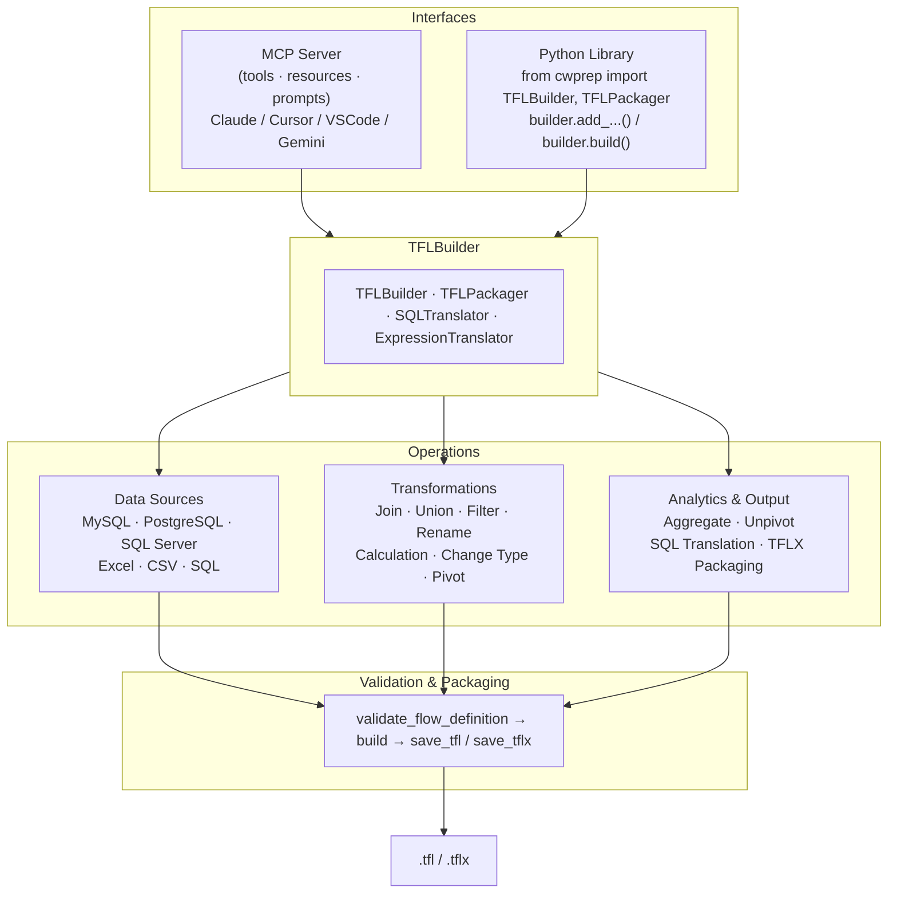
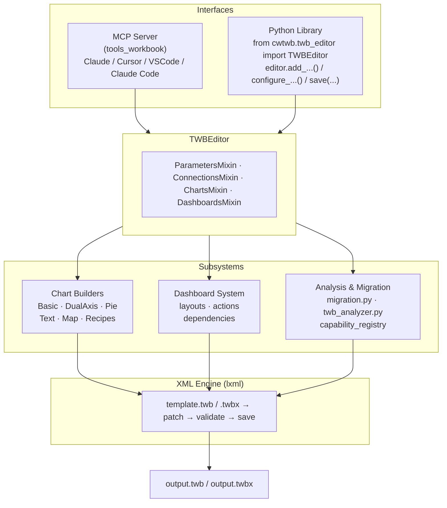

  

    

      

        Datacooper · Tableau User Group 分享
      

      <h1 class="mt-4 max-w-5xl text-5xl font-black tracking-[-0.05em] leading-[0.94] text-primary md:text-6xl">
        从手工拖拽到工程化 BI
      </h1>
      

        <strong class="text-foreground">cwprep</strong> 负责 Tableau Prep 的数据流自动化，
        <strong class="text-foreground">cwtwb</strong> 负责 Tableau Workbook 的工程化生成，
        <strong class="text-foreground">datacooper.com</strong> 则把这些能力做成更容易使用的在线工具平台。
      

      

        cwtwb/cwprep = BI 开发加速器
        MCP
        可复现
        可审查
        可迁移
      

    

  

---
layout: center
---

# 目录

  

    
01

    <h3 class="mt-1 text-lg font-bold text-foreground">背景与定位</h3>
    <ul class="mt-2 space-y-1 text-sm leading-6 text-muted-foreground">
      <li>工具定位 · Tableau 在数据流程中的位置</li>
      <li>机械劳动的痛点 · 适合谁</li>
    </ul>
  

  

    
02

    <h3 class="mt-1 text-lg font-bold text-foreground">cwprep · 数据流引擎</h3>
    <ul class="mt-2 space-y-1 text-sm leading-6 text-muted-foreground">
      <li>一句话介绍 · 分层架构图</li>
      <li>vs Tableau Agent · 案例与演示</li>
    </ul>
  

  

    
03

    <h3 class="mt-1 text-lg font-bold text-foreground">cwtwb · 工作簿工程</h3>
    <ul class="mt-2 space-y-1 text-sm leading-6 text-muted-foreground">
      <li>分层架构图 · vs Tableau Agent (Web)</li>
      <li>一句话介绍 · 实战案例与演示</li>
    </ul>
  

  

    
04

    <h3 class="mt-1 text-lg font-bold text-foreground">datacooper.com & 收尾</h3>
    <ul class="mt-2 space-y-1 text-sm leading-6 text-muted-foreground">
      <li>在线工具平台方向</li>
      <li>快速上手 · Q&A</li>
    </ul>
  

---
layout: fact
---

# cwtwb/cwprep 工具的定位

## 辅助加速 BI 开发过程

  不是替代 BI 开发人员，而是把重复、机械、可规则化的工作交给工具。

---
layout: center
class: text-center
---

# Tableau 在数据分析全流程中的位置

  

    
1. 数据接入

    
数据库、Excel、CSV、接口

  

  

    
2. 数据准备

    
清洗、转换、合并、聚合

  

  

    
3. Tableau

    
建模、计算、布局、可视化

  

  

    
4. 分发协作

    
发布、查看、评审、迭代

  

  

    
5. 反馈优化

    
修订数据、调整设计、重发版本

  

  cwprep 主要落在“数据准备”，cwtwb 主要落在“Tableau 生成与编排”，中间由 Tableau 承接分析表达。

---
layout: section
---

# 为什么要做这些工具

---
layout: center
class: text-center
---

# 机械劳动的痛点

  

    Tableau 里最耗时的，往往不是“画一个图”，而是机械性地反复做这些事。
  

  

    
反复拖拽字段

    
反复调布局

    
反复复制 KPI 模块

    
反复迁移 workbook

    
反复检查文件能否正常打开

    
反复修细碎但耗时的问题

  

---
layout: center
class: text-center
---

# 这些工具适合谁

  

    <h3 class="mt-2 text-lg font-bold text-foreground">Tableau 分析师</h3>
    
减少重复拖拽和复制粘贴，把时间还给业务分析和洞察判断。

  

  

    <h3 class="mt-2 text-lg font-bold text-foreground">数据工程 / IT</h3>
    
自动化、版本控制、批量部署，让 BI 进入工程化流程。

  

  

    <h3 class="mt-2 text-lg font-bold text-foreground">团队管理者</h3>
    
可审计、可复现、可交付，降低人员依赖和知识流失风险。

  

---
layout: section
---

# cwprep

---
layout: default
---

# cwprep 一句话介绍

  

    

      

        一句话
      

      <h2 class="mt-3 text-3xl font-black tracking-[-0.04em] text-foreground md:text-4xl">
        输入一句话，输出一个可用的 Tableau Prep .tfl / .tflx 文件。
      </h2>
    

    

      

        
Text-to-PrepFlow

        
直接用自然语言描述数据处理逻辑。

      

      

        
MCP 集成

        
可接 Claude、Gemini、Cursor 等客户端。

      

      

        
避免 GUI 依赖

        
不用每次打开 Tableau Prep 也能构建流程。

      

      

        
可审查

        
支持把 flow 翻译成 SQL，便于 DBA / 合规查看。

      

    

    

      22 种数据流操作
      4 种数据库
      SQL 翻译
      TFLX 打包
    

  

  

    

      核心价值
    

    

      cwprep 管"数据怎么流动"，cwtwb 管"仪表板怎么生成"。
    

    

      

        
效率加速

        
把重复性的 Prep 流搭建自动化。

      

      

        
质量稳定

        
把常见规则固化下来，减少人工偏差。

      

      

        
工程协作

        
让数据清洗进入脚本、版本控制和批量生产流程。

      

    

  

---
layout: center
class: text-center
---

# cwprep 架构图

---
layout: center
class: text-center
---

# cwprep vs Tableau Agent

  

    <h3 class="text-lg font-bold text-foreground">Tableau Agent</h3>
    <ul class="mt-3 space-y-2 text-sm leading-6 text-muted-foreground">
      <li>官方闭源产品</li>
      <li>自然语言驱动 Prep 流</li>
      <li>仅限 Tableau Cloud</li>
      <li>不支持 Join / Union</li>
      <li>不支持 SQL 导出</li>
    </ul>
    

      Source: <a href="https://help.tableau.com/current/prep/en-us/prep_einstein.htm" target="_blank" class="hover:text-primary transition-colors">https://help.tableau.com/current/prep/en-us/prep_einstein.htm</a>
    

  

  

    
VS

  

  

    <h3 class="text-lg font-bold text-primary">cwprep</h3>
    <ul class="mt-3 space-y-2 text-sm leading-6 text-foreground font-medium">
      <li>开源，可本地部署</li>
      <li>自然语言 + 代码双驱动</li>
      <li>支持任意环境</li>
      <li class="text-primary font-bold">✅ Join / Union / Pivot</li>
      <li class="text-primary font-bold">✅ Flow → SQL 翻译</li>
    </ul>
  

  功能覆盖率达 <strong class="text-primary">88%</strong>，并独享 Join、Union、SQL 翻译等能力。

---
layout: center
---

# cwprep 典型案例与快速演示

  

    

      <h3 class="text-xl font-bold mb-3 text-primary">案例 1：零门槛秒级生成</h3>
      

        完全不需要本地环境。用户通过自然语言将清洗逻辑发送给 Agent，系统在几秒内直接生成标准的 .tfl 文件。
      

      <ul class="mt-3 space-y-1 text-xs text-foreground font-medium">
        <li>✅ 文本直接转清洗流 (Text-to-Flow)</li>
        <li>✅ Web 端轻量化操作，无需安装</li>
      </ul>
    

    

      <h3 class="text-xl font-bold mb-3 text-primary">案例 2：多表复杂逻辑解析</h3>
      

        Agent 深度理解包含多步骤、跨多张表（订单、退货、客户）关联的业务描述，并精准转化为数据管道。
      

      <ul class="mt-3 space-y-1 text-xs text-foreground font-medium">
        <li>✅ 自动识别 ER 关系与 Join 逻辑</li>
        <li>✅ 处理复杂的聚合与过滤规则</li>
      </ul>
    

  

  

    

      

        <Youtube id="b7WrC0ngqwk" width="100%" height="100%" />
      

      <h4 class="font-bold text-xs text-center">视频演示：极速生成 (Seconds Response)</h4>
    

    

      

        <Youtube id="4RMevXQObkE" width="100%" height="100%" />
      

      <h4 class="font-bold text-xs text-center">视频演示：复杂逻辑 (Deep Parsing)</h4>
    

  

---
layout: section
---

# cwtwb

---
layout: center
class: text-center
---

# cwtwb 架构图

---
layout: center
class: text-center
---

# cwtwb vs Tableau Agent (Web)

  

    <h3 class="text-lg font-bold text-foreground">Tableau Agent (Web)</h3>
    <ul class="mt-3 space-y-2 text-sm leading-6 text-muted-foreground">
      <li>仅限 Worksheets (工作表)</li>
      <li>无法构建 Dashboard</li>
      <li>无法进行格式化美化</li>
      <li>不支持参数/集等交互控件</li>
      <li>不支持数据建模 (Join/Relation)</li>
    </ul>
    

      Source: <a href="https://help.tableau.com/current/online/en-us/web_author_einstein.htm" target="_blank" class="hover:text-primary transition-colors">https://help.tableau.com/current/online/en-us/web_author_einstein.htm</a>
    

  

  

    
VS

  

  

    <h3 class="text-lg font-bold text-primary">cwtwb</h3>
    <ul class="mt-3 space-y-2 text-sm leading-6 text-foreground font-medium">
      <li class="text-primary font-bold">✅ 完整的 Dashboard 编排</li>
      <li class="text-primary font-bold">✅ 声明式布局与格式化</li>
      <li class="text-primary font-bold">✅ 支持跨源数据迁移</li>
      <li class="text-primary font-bold">✅ XSD 结构校验与版本化</li>
      <li>支持离线/自动化批量生产</li>
    </ul>
  

  cwtwb 是 **"工程化 BI 生成器"**，填补了官方 Agent 在复杂布局和自动化生产上的空白。

---
layout: default
---

# cwtwb 一句话介绍

  

    

      

        一句话
      

      <h2 class="mt-3 text-3xl font-black tracking-[-0.04em] text-foreground md:text-4xl">
        把 Tableau workbook 变成可复现、可验证、可迁移的工程产物。
      </h2>
    

    

      

        
生成

        
从代码或 agent 调用生成 TWB。

      

      

        
校验

        
结构校验 + XSD 校验。

      

      

        
迁移

        
快速迁移到新数据源。

      

      

        
编排

        
支持 Chart、Layout 等编排。

      

    

    

      15+ 图表类型
      50+ MCP 工具
      XSD 校验
      声明式布局
    

  

  

    

      核心价值
    

    

      cwprep 管"数据怎么流动"，cwtwb 管"仪表板怎么生成"。
    

    

      

        
确定性输出

        
结果稳定复现。

      

      

        
交付可验证

        
能检查，能打开。

      

      

        
适合迁移项目

        
无需从零重建。

      

    

  

---
layout: center
---

# cwtwb 实战案例与闭环演示

  

    

      <h3 class="text-xl font-bold mb-3 text-primary">案例 3：声明式代码与自动纠错</h3>
      

        演示 Python 开发框架的 4 步流程：感知架构、生成代码、运行脚本、自动纠错（Bug Fix）。
      

      <ul class="mt-3 space-y-1 text-xs text-foreground font-medium">
        <li>✅ AI 感知数据库 Schema / ER 图</li>
        <li>✅ <strong>亮点：</strong> Agent 自动修正大小写敏感错误</li>
      </ul>
    

    

      <h3 class="text-xl font-bold mb-3 text-primary">案例 4：端到端实时仪表板渲染</h3>
      

        从原始文档到功能完备的 Tableau 仪表板。观众可以实时观察到 Dashboard 在客户端从无到有的渲染过程。
      

      <ul class="mt-3 space-y-1 text-xs text-foreground font-medium">
        <li>✅ 全流程自动化闭环</li>
        <li>✅ 像写代码一样“热更新”仪表板</li>
      </ul>
    

  

  

    

      

        <Youtube id="dNzMbLOEA7A" width="100%" height="100%" />
      

      <h4 class="font-bold text-xs text-center">视频演示：Python 实战与自动纠错</h4>
    

    

      

        <Youtube id="NMy4__CCCDI" width="100%" height="100%" />
      

      <h4 class="font-bold text-xs text-center">视频演示：Dashboard 实时渲染</h4>
    

  

---
layout: section
---

# datacooper.com

---
layout: default
---

# datacooper 在线工具原型

  

    

      

        未来方向
      

      <h2 class="mt-3 text-3xl font-black tracking-[-0.04em] text-foreground md:text-4xl">
        把这些能力做成在线工具平台，而不只是本地脚本。
      </h2>
      

        不是把命令搬到网页，而是把常见 BI 动作变成上传即用、顺手操作的在线工作台。底层共用 Python SDK。
      

    

    

      
在线使用

      
直接处理文件

      
更低门槛

      
代码变工具

    

  

  

    

      已有的两个工具原型
    

    

      

        
布局解析

        
提取 dashboard 布局结构，导出 JSON。

      

      

        
KPI 复制

        
复制 KPI 工作表，只替换指标，保留原结构和样式。

      

    

    

      
更长远

      

        协作与版本管理 — 创想方向，非当前承诺。
      

    

  

---
layout: center
class: text-center
---

# 试试看

  

    
# 1. 安装 SDK

    
$ pip install cwprep

    
$ pip install cwtwb

    
# 2. 配置 MCP (Claude Desktop / Cursor)

    <pre class="bg-black/5 p-2.5 rounded-lg text-[11px] leading-relaxed whitespace-pre overflow-auto">
{{ `{
  "mcpServers": {
    "cwprep": { "command": "uvx", "args": ["cwprep"] },
    "cwtwb": { "command": "uvx", "args": ["cwtwb"] }
  }
}` }}
    </pre>
  

  

    <a href="https://github.com/imgwho/cwprep" target="_blank" class="rounded-[20px] border border-primary/50 bg-white/50 px-4 py-3 text-left shadow-sm hover:bg-primary/5 transition-colors no-underline">
      
GitHub: cwprep

      
github.com/imgwho/cwprep

    </a>
    <a href="https://github.com/imgwho/cwtwb" target="_blank" class="rounded-[20px] border border-primary/50 bg-white/50 px-4 py-3 text-left shadow-sm hover:bg-primary/5 transition-colors no-underline">
      
GitHub: cwtwb

      
github.com/imgwho/cwtwb

    </a>
    <a href="https://datacooper.com" target="_blank" class="col-span-full rounded-[20px] border border-primary/50 bg-white/50 px-4 py-3 text-left shadow-sm hover:bg-primary/5 transition-colors no-underline">
      
datacooper.com

      
在线工具 · 文档 · 社区

    </a>
  

---
layout: center
---

# 致谢

  

    

      
Patrick Therriault

      
引导我深入 Tableau 社区

    

    

      
Andy Cotgreave

      
推动项目前进的洞察

    

    

      
Adam Mico

      
耐心与扎实的建议

    

    

      
Jeffrey Shaffer

      
推荐的技巧成为很好的过程约束

    

    

      
Matthew Miller · Elif Tutuk · Paul Morgan · Olga L.

      
来自官方的极有价值的提示

    

    

      
Li-Lun Tu

      
品牌建设方面的建议

    

  

  

    
Alex Mou

    
鼓励以及交流中给我的建议

  

  

    
感谢每一位留言和参与讨论、帮助我走在正确方向上的朋友！

  

---
layout: quote
---

# 不离开 Tableau，用 AI 把时间还给人类。

---
layout: section
---

# Q&A / 交流
