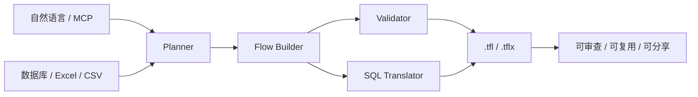
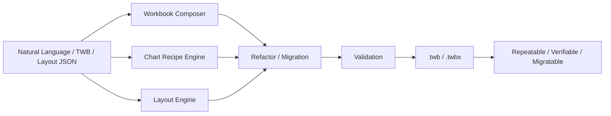

  

    

      

        Datacooper · Tableau User Group 分享
      

      <h1 class="mt-4 max-w-5xl text-5xl font-black tracking-[-0.05em] leading-[0.94] text-primary md:text-6xl">
        从手工拖拽到工程化 BI
      </h1>
      

        <strong class="text-foreground">cwprep</strong> 负责 Tableau Prep 的数据流自动化，
        <strong class="text-foreground">cwtwb</strong> 负责 Tableau Workbook 的工程化生成，
        <strong class="text-foreground">datacooper.com</strong> 则把这些能力做成更容易使用的在线工具平台。
      

      

        Python 工具 = BI 开发加速器
        MCP
        可复现
        可审查
        可迁移
      

    

  

---
layout: fact
---

# Python 工具的定位

## 辅助加速 BI 开发过程

  不是替代 BI 开发人员，而是把重复、机械、可规则化的工作交给工具。

---
layout: center
class: text-center
---

# Tableau 在数据分析全流程中的位置

  

    
1. 数据接入

    
数据库、Excel、CSV、接口

  

  

    
2. 数据准备

    
清洗、转换、合并、聚合

  

  

    
3. Tableau

    
建模、计算、布局、可视化

  

  

    
4. 分发协作

    
发布、查看、评审、迭代

  

  

    
5. 反馈优化

    
修订数据、调整设计、重发版本

  

  cwprep 主要落在“数据准备”，cwtwb 主要落在“Tableau 生成与编排”，中间由 Tableau 承接分析表达。

---
layout: section
---

# 为什么要做这些工具

---
layout: center
class: text-center
---

  

    Tableau 里最耗时的，往往不是“画一个图”，而是机械性地反复做这些事。
  

  

    
反复拖拽字段

    
反复调布局

    
反复复制 KPI 模块

    
反复迁移 workbook

    
反复检查文件能否正常打开

    
反复修细碎但耗时的问题

  

  

    这些事单个看都不难，但它们不创造新的业务价值，却持续消耗开发时间。
  

---
layout: center
---

# 研发范式的改变

  

    <h3 class="text-2xl font-bold mb-6 text-foreground">传统方式 (Manual)</h3>
    <ul class="space-y-4 text-muted-foreground text-lg">
      <li class="flex items-start gap-3">❌ 300+ 次重复的鼠标点击</li>
      <li class="flex items-start gap-3">❌ 无法复用的二进制 .twb 文件</li>
      <li class="flex items-start gap-3">❌ 变更时需全量重新拖拽</li>
      <li class="flex items-start gap-3">❌ 逻辑隐藏在 GUI 深处，无法审计</li>
    </ul>
  

  
  

    <h3 class="text-2xl font-bold mb-6 text-primary">工程化方式 (Engineering)</h3>
    <ul class="space-y-4 text-foreground font-medium text-lg">
      <li class="flex items-start gap-3">✅ 一行命令/一句话生成</li>
      <li class="flex items-start gap-3">✅ 纯文本配置，可 Git 管理</li>
      <li class="flex items-start gap-3">✅ 模块化组件，秒级替换指标</li>
      <li class="flex items-start gap-3">✅ 代码即文档，随时可追溯审计</li>
    </ul>
  

---
layout: center
class: text-center
---

# 这些工具适合谁

  

    
📊

    <h3 class="mt-2 text-lg font-bold text-foreground">Tableau 分析师</h3>
    
减少重复拖拽和复制粘贴，把时间还给业务分析和洞察判断。

  

  

    
⚙️

    <h3 class="mt-2 text-lg font-bold text-foreground">数据工程 / IT</h3>
    
自动化、版本控制、批量部署，让 BI 进入工程化流程。

  

  

    
📋

    <h3 class="mt-2 text-lg font-bold text-foreground">团队管理者</h3>
    
可审计、可复现、可交付，降低人员依赖和知识流失风险。

  

---
layout: section
---

# cwprep

---
layout: center
class: text-center
---

# cwprep 架构图

---
layout: default
---

## cwprep

### 一句话

输入一句话，输出一个可用的 Tableau Prep `.tfl` / `.tflx` 文件。

### 它能做什么

- Text-to-PrepFlow: 直接用自然语言描述数据处理逻辑
- MCP 集成: 可接 Claude、Gemini、Cursor 等客户端
- 避免 GUI 依赖: 不用每次打开 Tableau Prep 也能构建流程
- 可审查: 支持把 flow 翻译成 SQL，便于 DBA / 合规查看

  MCP（Model Context Protocol）是让 AI 工具互相调用的开放协议，可以理解为 <strong class="text-foreground">AI 的 USB 接口</strong>

  22 种数据流操作
  4 种数据库
  SQL 翻译
  TFLX 打包

---
layout: center
class: text-center
---

# cwprep 典型案例

  

    <h3 class="text-xl font-bold text-foreground">数据合并与连接</h3>
    
自动化处理多数据源 Join 逻辑。

  

  

    <h3 class="text-xl font-bold text-foreground">自动化数据清洗</h3>
    
根据业务规则自动完成类型转换与过滤。

  

  

    <h3 class="text-xl font-bold text-foreground">指标聚合计算</h3>
    
在 Prep 层预处理复杂的业务指标。

  

  

    <h3 class="text-xl font-bold text-foreground">全流程自动化</h3>
    
从原始数据到 TFLX 文件的端到端生成。

  

---
layout: center
class: text-center
---

  

    <h3 class="text-xl font-bold text-foreground">效率加速</h3>
    
把重复性的 Prep 流搭建自动化。

  

  

    <h3 class="text-xl font-bold text-foreground">质量稳定</h3>
    
把常见规则固化下来，减少人工偏差。

  

  

    <h3 class="text-xl font-bold text-foreground">工程协作</h3>
    
让数据清洗进入脚本、版本控制和批量生产流程。

  

---
layout: center
class: text-center
---

# cwprep vs Tableau Agent

  

    <h3 class="text-lg font-bold text-foreground">Tableau Agent</h3>
    <ul class="mt-3 space-y-2 text-sm leading-6 text-muted-foreground">
      <li>官方闭源产品</li>
      <li>自然语言驱动 Prep 流</li>
      <li>仅限 Tableau Cloud</li>
      <li>不支持 Join / Union</li>
      <li>不支持 SQL 导出</li>
    </ul>
  

  

    
VS

  

  

    <h3 class="text-lg font-bold text-primary">cwprep</h3>
    <ul class="mt-3 space-y-2 text-sm leading-6 text-foreground font-medium">
      <li>开源，可本地部署</li>
      <li>自然语言 + 代码双驱动</li>
      <li>支持任意环境</li>
      <li class="text-primary font-bold">✅ Join / Union / Pivot</li>
      <li class="text-primary font-bold">✅ Flow → SQL 翻译</li>
    </ul>
  

  功能覆盖率达 <strong class="text-primary">88%</strong>，并独享 Join、Union、SQL 翻译等能力。

---
layout: section
---

# cwtwb

---
layout: center
class: text-center
---

# cwtwb 架构图

---
layout: default
---

  

    

      

        一句话
      

      <h2 class="mt-3 text-3xl font-black tracking-[-0.04em] text-foreground md:text-4xl">
        把 Tableau workbook 变成可复现、可验证、可迁移的工程产物。
      </h2>
    

    

      

        
生成

        
从代码或 agent 调用生成 TWB。

      

      

        
校验

        
结构校验 + XSD 校验。

      

      

        
迁移

        
快速迁移到新数据源。

      

      

        
编排

        
支持 Chart、Layout 等编排。

      

    

    

      15+ 图表类型
      50+ MCP 工具
      XSD 校验
      声明式布局
    

  

  

    

      核心价值
    

    

      cwprep 管"数据怎么流动"，cwtwb 管"仪表板怎么生成"。
    

    

      

        
确定性输出

        
结果稳定复现。

      

      

        
交付可验证

        
能检查，能打开。

      

      

        
适合迁移项目

        
无需从零重建。

      

    

  

---
layout: center
class: text-center
---

# cwtwb 典型案例

  

    <h3 class="text-xl font-bold text-foreground">端到端自动化生成</h3>
    
从代码一键生成完整的 TWBX 文件。

  

  

    <h3 class="text-xl font-bold text-foreground">工作表局部重构</h3>
    
只替换特定的 KPI 指标，保留原始排版。

  

  

    <h3 class="text-xl font-bold text-foreground">跨环境数据源迁移</h3>
    
快速适配测试环境与生产环境的数据源变更。

  

  

    <h3 class="text-xl font-bold text-foreground">声明式布局管理</h3>
    
用 JSON 定义仪表板布局，批量生成看板。

  

---
layout: section
---

# datacooper.com

---
layout: default
---

  

    

      

        未来方向
      

      <h2 class="mt-3 text-3xl font-black tracking-[-0.04em] text-foreground md:text-4xl">
        把这些能力做成在线工具平台，而不只是本地脚本。
      </h2>
      

        不是把命令搬到网页，而是把常见 BI 动作变成上传即用、顺手操作的在线工作台。底层共用 Python SDK。
      

    

    

      
在线使用

      
直接处理文件

      
更低门槛

      
代码变工具

    

  

  

    

      已有的两个工具原型
    

    

      

        
布局解析

        
提取 dashboard 布局结构，导出 JSON。

      

      

        
KPI 复制

        
复制 KPI 工作表，只替换指标，保留原结构和样式。

      

    

    

      
更长远

      

        协作与版本管理 — 创想方向，非当前承诺。
      

    

  

---
layout: center
class: text-center
---

# 试试看

  

    

      
$ pip install cwprep cwtwb

      
$ cwprep-mcp # 启动 cwprep MCP 服务器

      
$ cwtwb-mcp # 启动 cwtwb MCP 服务器

    

  

  

    

      
GitHub

      
github.com/imgwho/cwprep github.com/imgwho/cwtwb

    

    

      
datacooper.com

      
在线工具 · 文档 · 社区

    

  

  
开源 · AGPL-3.0 · 欢迎 Star、试用、反馈

---
layout: quote
---

# 我们不是要让人离开 Tableau，而是要让人把时间花在真正重要的地方。
